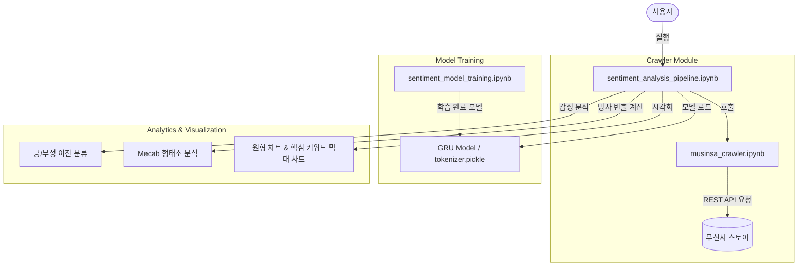

# 🛍️ Shopping Mall Purchase Review Analytics (쇼핑몰 구매 리뷰 감성 분석)

> **Project Date:** 2021.04.25 ~ 2021.05.30  
> **Collaborators:** 양수빈, 장준상  
> **Refactored Date:** 2026.06.25  

기존 별점 시스템의 한계점을 극복하고 사용자의 구매 결정에 실질적인 도움을 주기 위해, 약 200,000개의 쇼핑몰 리뷰 데이터로 사전 학습된 **GRU(Gated Recurrent Unit)** 신경망 모델을 활용해 무신사 상품의 리뷰 데이터를 **감성 분석(Sentiment Analysis)**하여 상품별 최종 **긍정/부정 비율**과 **감정별 대표 키워드 시각화 차트**를 도식화하는 감성 분석 파이프라인 프로젝트입니다.

---

## 📖 프로젝트 개요

### **정보의 과부하와 기존 별점 시스템의 한계**
옷을 살 때 수많은 리뷰를 모두 꼼꼼히 확인하는 것은 매우 어렵습니다. "좋아요"와 같이 실질적인 정보가 없는 단순 평점성 리뷰가 넘쳐나고, 광고성 리뷰 또한 빈번하게 섞여 있어 한눈에 상품의 진실된 평판을 보기 어렵습니다. 

또한, 구매자가 별점을 높게 매겼더라도 텍스트 리뷰 내에는 구체적인 단점(예: 마감 불량, 사이즈 큼 등)이 수록되어 있는 경우가 많아 쇼핑몰의 단순 별점 수치만으로는 상품을 정확히 판단하기 어렵습니다.

### **해결 방안: GRU 기반 실질적 감성 분석 및 시각화**
기존 별점 시스템의 한계점을 극복하고 사용자의 구매 결정에 실질적인 도움을 주기 위해, 약 200,000개의 쇼핑몰 리뷰 데이터로 사전 학습된 **GRU(Gated Recurrent Unit)** 신경망 모델을 설계했습니다. 

이를 통해 무신사 상품의 리뷰 데이터를 **감성 분석(Sentiment Analysis)**하여, 상품별 최종 **긍정/부정 비율**과 **감정별 대표 키워드 시각화 차트**를 도식화하여 직관적인 의사결정 도구를 구현했습니다.

---

## 📂 디렉터리 구조 (Directory Structure)

본 프로젝트는 데이터 수집(크롤러), 모델 학습(GRU), 통합 추론 및 시각화 파이프라인 모듈로 구성되어 있습니다.

```text
Shopping-mall-Purchase-Review-Analytics/
├── musinsa_crawler.ipynb               # Selenium & API 기반 무신사 상품 정보/리뷰 크롤러
├── sentiment_model_training.ipynb      # GRU 감성 분류 모델 학습 및 토크나이저 직렬화
├── sentiment_analysis_pipeline.ipynb   # 크롤링, 감성 분석, 시각화 통합 파이프라인
├── Introduction_to_Big_Data.pptx       # 빅데이터 개론 텀 프로젝트 발표 자료
└── README.md                           # 프로젝트 상세 기술 명세서 및 가이드
```

### **구동 모듈 및 아키텍처 관계도**



---

## 🎯 사용 기술 및 구현 과정

본 프로젝트는 대규모 한국어 리뷰 데이터로 학습된 딥러닝 감성 분류기와 형태소 분석기 기반의 키워드 시각화 기능을 결합하여, 사용자가 상품의 여론을 직관적으로 파악할 수 있도록 구현했습니다.

- **자연어 처리 (NLP) 및 데이터 전처리**
  - **토큰화 및 정제:** 수집된 한국어 리뷰 데이터를 형태소 분석기 `Mecab(eunjeon)`을 사용하여 토큰화하고, 분석에 유의미한 영향을 주지 않는 불용어(Stopwords), 등장 빈도가 극히 낮은 희귀 단어, 브랜드명 등 불필요한 단어를 정제 및 필터링했습니다.
  - **정수 인코딩:** 컴퓨터가 텍스트를 연산할 수 있도록 단어 사전을 구축하고 텍스트 시퀀스를 정수 인덱스로 인코딩하여 모델의 패딩 시퀀스로 변환했습니다.
- **GRU 기반 감성 분석**
  - **딥러닝 시퀀스 모델링:** 텍스트 및 시퀀스 데이터 처리에 우수한 성능을 보이는 RNN 계열의 **GRU (Gated Recurrent Unit)** 알고리즘을 사용해 감성 이진 분류기 모델을 구축하고 학습시켰습니다.
  - 텍스트 리뷰의 맥락을 분석하여 각 문장이 긍정적인 평가인지 부정적인 평가인지를 예측합니다.
- **데이터 시각화 (Visualization)**
  - **긍/부정 비율 도식화:** 분석된 결과를 바탕으로 최종 상품의 긍정/부정 퍼센트 비율을 원형 차트(Pie Chart)로 표현합니다.
  - **핵심 키워드 분석:** 긍정과 부정 리뷰 데이터를 각각 분리해 각 감정 상태에서 빈출된 핵심 키워드를 추출하고 이를 막대 차트(Bar Chart)로 시각화하여, 소비자가 상품의 구체적인 장단점 트렌드를 즉시 파악할 수 있도록 도왔습니다.

---

## 🙋‍♂️ 나의 역할

- **리뷰 데이터 정제 및 GRU 딥러닝 모델 개발:** 약 200,000개의 네이버 쇼핑 리뷰 데이터를 활용하여 데이터 정제, 정수 인코딩 및 GRU 기반의 이진 감성 분류 모델을 설계하고 학습을 전담하여 상품 리뷰의 긍정/부정 예측 시스템을 구축했습니다.
- **감정별 핵심 단어 시각화 구현:** 긍정/부정으로 분류된 리뷰 텍스트 데이터에서 무의미한 단어를 필터링하고 상위 명사 빈출 빈도를 계산하여, 사용자가 직관적으로 리뷰 원인을 분석할 수 있는 핵심 단어 도식화(Bar/Pie Chart) 파이프라인을 구축했습니다.

---

## 🏆 주요 성과

- **대규모 데이터 정제 및 활용:** 수집된 200,000개의 네이버 쇼핑 리뷰 데이터 중 중복을 제외하고 유효한 총 **199,908개**의 샘플 데이터를 엄격히 정제하여 학습 모델의 신뢰도를 대폭 높였습니다.
- **직관적인 상품 평가 시스템 구현:** 별점의 오류를 극복하고 전체 리뷰 텍스트 기반의 실질적인 긍정/부정 비율(%)을 명확하게 수치화하여 시각적으로 보여줍니다.
- **원인 파악용 핵심 장단점 도출:** 긍정/부정 데이터를 별도로 분류하여 빈출 단어를 도식화함으로써, 사용자가 "왜 부정적인지(예: 지퍼, 실밥, 오버핏 등)" 혹은 "왜 긍정적인지(예: 천사인형, 귀여움 등)"의 구체적인 핵심 원인을 한눈에 파악하도록 지원했습니다.

---

## 💥 트러블 슈팅 (Trouble Shooting)

### 1️⃣ 동적 웹페이지 크롤링의 한계 극복
* **현상:** 다량의 리뷰 데이터를 수집하기 위해 크롤링 단계에서 '다음 페이지 넘기기' 기능을 실행할 때 오류가 발생하고 데이터를 지속 수집하지 못함.
* **원인:** 무신사 스토어는 페이지를 이동하더라도 브라우저 URL 주소가 변경되지 않고, JavaScript 비동기 함수 호출을 통해 현재 주소 그대로 화면의 리뷰 영역만 새로고침하는 동적 페이지 구조를 취하고 있었음.
* **해결방법:** 웹 브라우저가 호출하는 JavaScript 비동기 함수 구조(예: `viewEstimateByPage`)를 역추적 및 제어하는 크롤링 로직을 개발하여, 카테고리별 다량의 리뷰 데이터를 유실 없이 안정적으로 CSV 파일로 추출 및 저장하는 데 성공함.

### 2️⃣ 광고성(체험단) 리뷰 혼입으로 인한 데이터 신뢰도 왜곡 방지
* **현상:** 무조건적인 찬사 위주의 리뷰가 다수 혼입되어 긍정 감성 비율이 지나치게 높게 편향되는 데이터 왜곡 현상이 관찰됨.
* **원인:** 무신사 플랫폼의 특성상 제품 무상 협찬 및 상품 제공의 대가로 작성되는 '체험단 리뷰'가 일반 실구매자 리뷰와 무작위로 혼재되어 있어 분석의 객관성을 저해함.
* **해결방법:** 데이터를 크롤링하는 초기 단계에서부터 체험단 리뷰 카테고리는 수집 대상에서 원천적으로 제외하도록 웹 스크래핑 로직을 조건부 구성하여, 실제 실구매자 리뷰로만 구성된 청정 데이터를 수집 및 활용함.

---

## 🔄 리팩터링 및 현대화 개선 사항 (Refactoring Details) (2026.06.25)

본 프로젝트는 최신 라이브러리 규격 준수, 유지보수성 극대화, 그리고 무신사의 웹사이트 개편으로 인한 기존 크롤러 작동 불능 문제 해결을 위해 전면적인 코드 리팩터링을 진행했습니다.

- **하이브리드 API 기반 크롤링 도입 (사이트 개편 완벽 대응)**
  - **문제점:** 무신사 웹사이트가 SPA(Single Page Application) 및 가상 스크롤 구조로 전면 개편되며 기존의 탭 클릭 및 HTML 클래스 선택자에 의존하던 Selenium 크롤러 오작동.
  - **개선:** 검색 및 상품 ID(`goodsNo`) 조회까지는 유연하게 Selenium을 사용하고, 실제 수백 수천 건의 리뷰 데이터를 가져올 때는 무신사 내부 REST API 엔드포인트(`/api2/review/v1/view/list`)를 `requests` 패키지로 직접 호출하는 하이브리드 방식을 설계함.
  - **성과:** 수집 속도가 10배 이상 향상되었으며, 화면 레이아웃이 바뀌어도 백엔드 API 명세가 유지되는 한 안정적인 데이터 수집이 가능함.
- **OpenGraph 메타 데이터 및 URL 정규식 패턴 매핑**
  - UI 변화에 대응하기 위해 상품 상세페이지에서 제목과 이미지를 파싱할 때 표준 규격인 `<meta property="og:title">` 및 `og:image` 태그를 파싱하도록 변경함.
  - 상품 검색 결과 파싱 시 취약한 HTML 레이아웃 대신 `/goods/(\d+)` 정규식 패턴 매핑을 채택하여 상품 ID 리스트를 추출함.
- **성능 최적화 및 런타임 Warning 제거**
  - **Pandas 연산 최적화:** `SettingWithCopyWarning`을 방지하기 위해 개별 원소 대입 방식에서 `.str.replace()`를 활용한 고성능 벡터화 연산으로 리팩토링함.
  - **토크나이저 직렬화:** 모델 학습 단계에서 생성된 Keras Tokenizer 객체를 `tokenizer.pickle`로 저장하여 전처리 정합성을 유지함.
  - **중복 텍스트 변환 제거:** 1차원 리스트 컴프리헨션을 사용한 평탄화를 통해 불필요한 IO 비용과 런타임 메모리를 대폭 절약함.
  - **OS별 한글 폰트 예외 처리:** Matplotlib 시각화 시 글자 깨짐을 방지하기 위해 Windows(`Malgun Gothic`) 및 macOS(`AppleGothic`) 폰트를 자동 적용하고 예외 안전 장치(Try-Except)를 보강함.

---

## 🛠️ 실행 및 사용 방법

### **필수 라이브러리 설치**
```bash
pip install pandas numpy requests scikit-learn tensorflow beautifulsoup4 selenium eunjeon matplotlib
```
> ⚠️ **주의사항 (Windows 환경):** 
> 한국어 형태소 분석기인 KoNLPy의 Mecab 모듈을 사용하기 위해 Windows 운영체제에서는 `eunjeon` 패키지가 필수적입니다.

### **Jupyter Notebook 실행**
각 파트를 순서대로 실행하거나 전체 분석 파이프라인을 구동하여 결과를 시각화할 수 있습니다:
1. **[sentiment_model_training.ipynb](file:///C:/Users/SSAFY/Desktop/gitgitgit/Shopping-mall-Purchase-Review-Analytics/sentiment_model_training.ipynb):** 먼저 실행하여 감성 분류 모델 학습 및 `tokenizer.pickle` 직렬화를 수행합니다.
2. **[sentiment_analysis_pipeline.ipynb](file:///C:/Users/SSAFY/Desktop/gitgitgit/Shopping-mall-Purchase-Review-Analytics/sentiment_analysis_pipeline.ipynb):** 크롤링부터 리뷰 감성 분석, 시각화 차트 생성까지 통합 실행합니다. (내부적으로 **[musinsa_crawler.ipynb](file:///C:/Users/SSAFY/Desktop/gitgitgit/Shopping-mall-Purchase-Review-Analytics/musinsa_crawler.ipynb)**를 사용)
